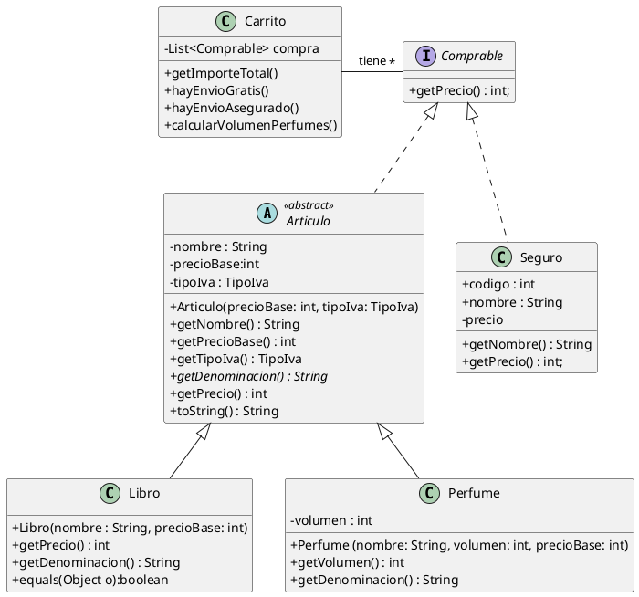

# borrame
Fenomenal

```plantuml
@startuml
skinparam classAttributeIconSize 0 
abstract class Articulo <<abstract>>{
  - nombre : String
  - precioBase:int
  - tipoIva : TipoIva
  
  + Articulo(precioBase: int, tipoIva: TipoIva)
  + getNombre() : String
  + getPrecioBase() : int
  + getTipoIva() : TipoIva
  + {abstract} getDenominacion() : String
  + getPrecio() : int
  + toString() : String
}

class Libro extends Articulo {
  + Libro(nombre : String, precioBase: int)
  + getPrecio() : int
  + getDenominacion() : String
  + equals(Object o):boolean
}

class Perfume extends Articulo {
  - volumen : int
  + Perfume (nombre: String, volumen: int, precioBase: int)
  + getVolumen() : int
  + getDenominacion() : String
}

class Seguro {
  + codigo : int
  + nombre : String
  - precio
  + getNombre() : String
  + getPrecio() : int;
}


interface Comprable {
  + getPrecio() : int;
  }
  

Seguro .up.|> Comprable
Articulo .up.|> Comprable

class Carrito {
    -List<Comprable> compra
    + getImporteTotal()
    + hayEnvioGratis()
    + hayEnvioAsegurado()
    + calcularVolumenPerfumes()
}

Carrito -right- "*" Comprable : tiene

@enduml
```
